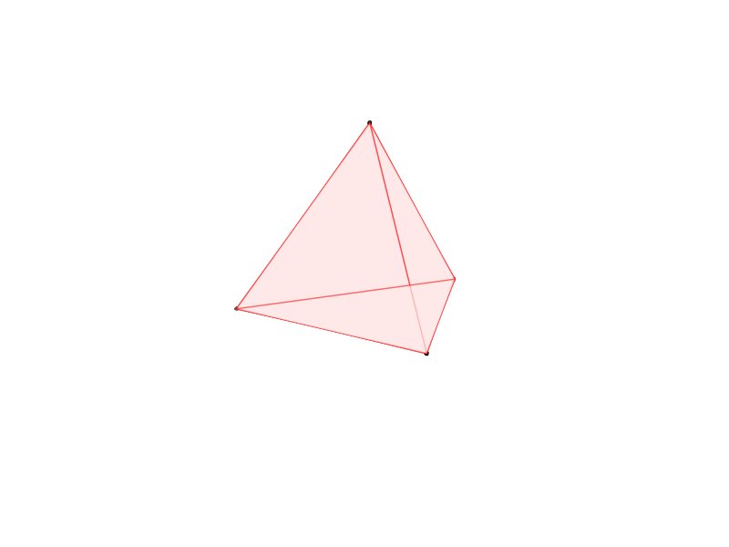
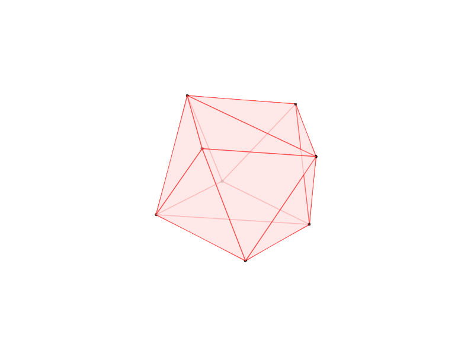
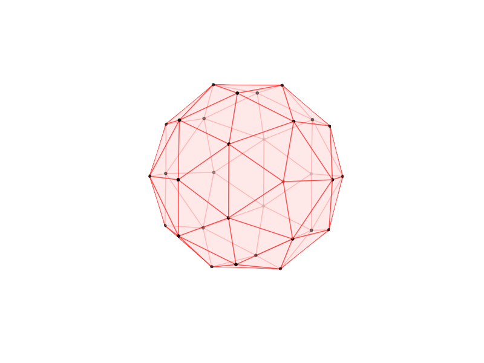
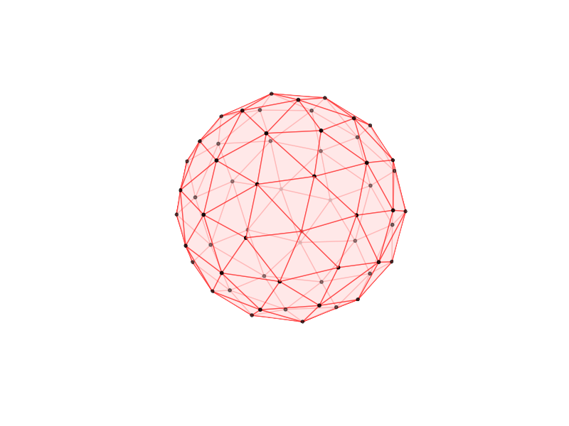

# University-Dissertation

A look at the Thomson problem for a 2-sphere using two Monte Carlo methods in Python

[Dissertation PDF](https://github.com/beng1302/University-Dissertation/blob/master/Project.pdf)

[Thomson Problem Code](https://github.com/beng1302/University-Dissertation/blob/master/doc1.py)

[Density of States Code](https://github.com/beng1302/University-Dissertation/blob/master/doc2.py)

 
 
